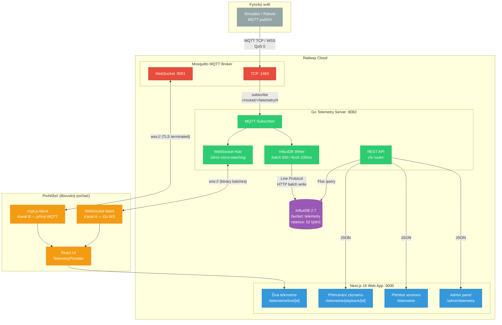
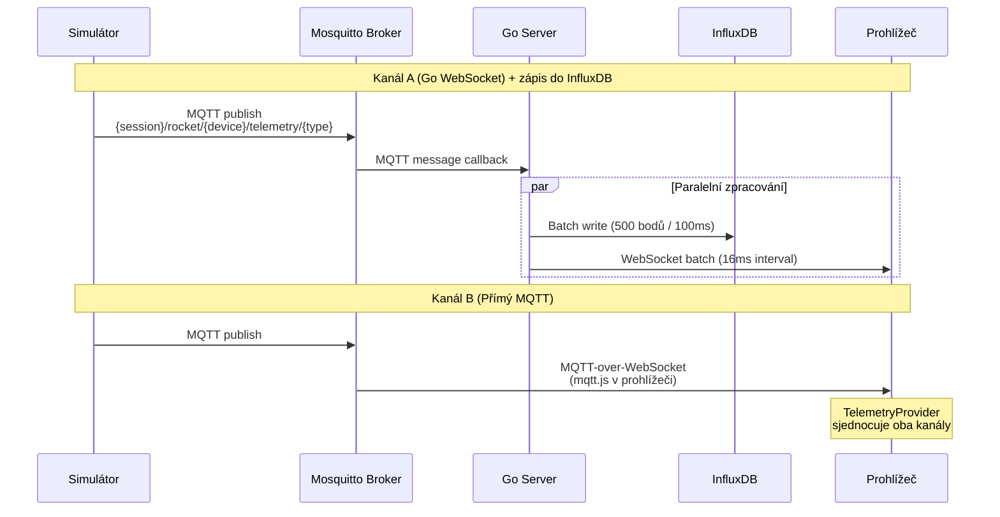
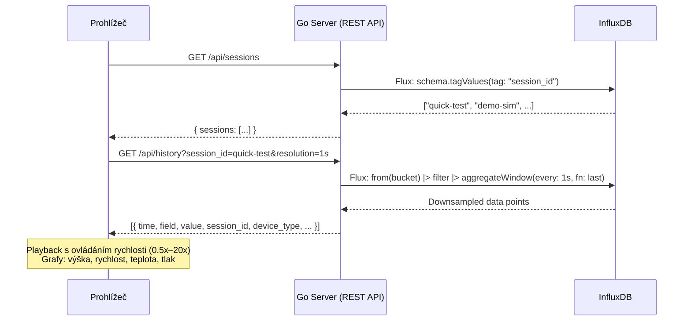
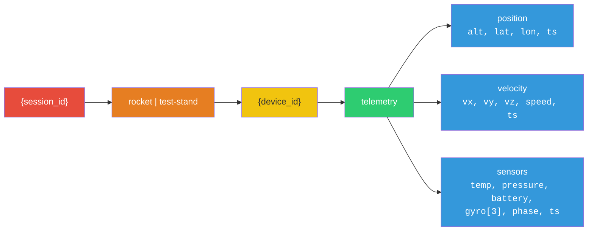
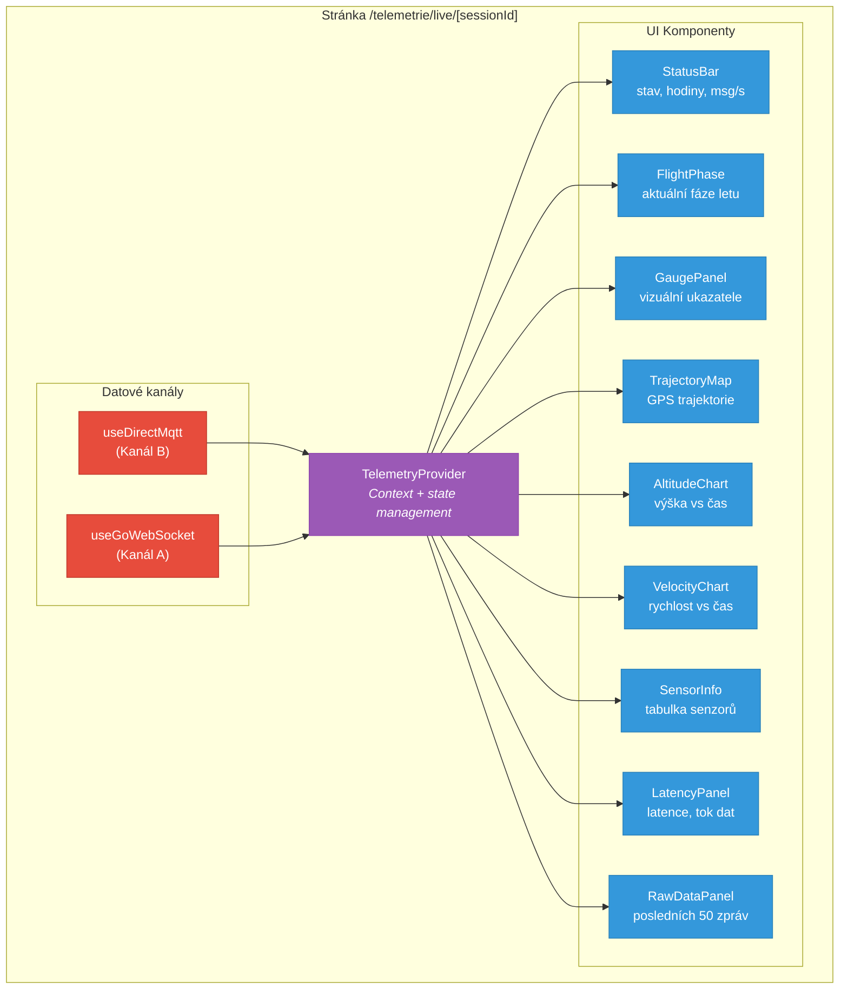
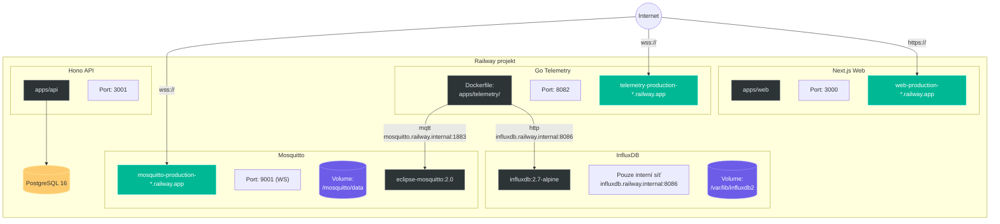

# Architektura telemetrického systému CRS

## 1. Celkový přehled systému



## 2. Datový tok — živá telemetrie



## 3. Datový tok — přehrávání záznamu



## 4. MQTT topic hierarchie



## 5. Komponentová architektura frontendu



## 6. Fáze letu simulátoru

```mermaid
stateDiagram-v2
    [*] --> Countdown: t=0
    Countdown --> Launch: ignition
    Launch --> Ascent: motor burn
    Ascent --> Coast: engine cutoff
    Coast --> Apogee: peak altitude
    Apogee --> Descent: drogue chute
    Descent --> Landing: main chute
    Landing --> Complete: touchdown
    Complete --> [*]

    state Countdown {
        note right of Countdown
            Demo: 5% délky
            Realistický: 20 min
            Alt: 0 m, Speed: 0 m/s
            Temp: ~18°C
        end note
    }

    state Ascent {
        note right of Ascent
            120→300 m/s
            Max výška: 3000 m
            Temp: 20→80°C
        end note
    }

    state Descent {
        note right of Descent
            Drogue: -25 m/s
            Main chute: -6 m/s
            ~200s (realistický)
        end note
    }
```

## 7. Nasazení na Railway



## 8. Porty a protokoly

| Komponenta | Protokol | Port | Popis |
|---|---|---|---|
| Mosquitto (TCP) | MQTT | 1883 | Interní komunikace (Go server, simulátor lokálně) |
| Mosquitto (WS) | MQTT-over-WebSocket | 9001 | Prohlížeč — přímý kanál B |
| Go Telemetry | HTTP + WebSocket | 8082 | REST API + kanál A |
| InfluxDB | HTTP | 8086 | Time-series databáze |
| Next.js Web | HTTP | 3000 | Frontend |
| Hono API | HTTP | 3001 | Backend REST API |
| PostgreSQL | TCP | 5432 | Relační databáze |

> **Poznámka:** Railway automaticky terminuje TLS — prohlížeč se připojuje přes `wss://` / `https://`, Railway přeposílá jako plain `ws://` / `http://` do kontejneru.
